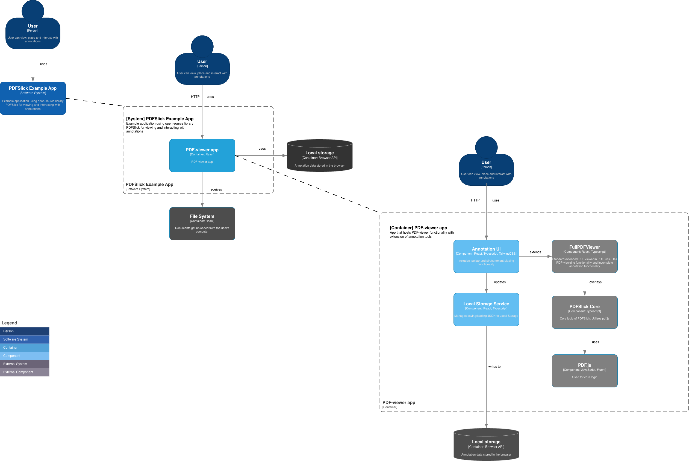

# PDF Comments Example
This example allows users to add comments to placeable pins in PDFs with PDFSlick. The example is built on top of the 'PDFSlick Full Viewer App' example.

## Table of Contents
- [Features](#features)
  - [Annotation / Pin Features](#annotation--pin-features)
  - [Comment Features](#comment-features)
  - [Persistence](#persistence)
- [Getting Started](#getting-started)
  - [Prerequisites](#prerequisites)
  - [Installation & Running](#installation--running)
  - [View the Example](#view-the-example)
- [User Guide](#user-guide)
- [Overview](#overview)
  - [C4-model](#c4-model)
  - [Component Structure](#component-structure)
- [Future Plans](#future-plans)

---

## Features
 The Comments example contains the following extra features:

### Annotation / Pin Features
- Place colored pins anywhere on PDF pages.
- Select and delete pins.

### Comment Features  
- Attach comments to pins.
- Reply to comments (threaded conversations).
- Delete comments.
- Browse all comments in a sidebar.
- Click a comment to jump to its pin.

### Persistence
- All pins and comments are saved to browser localStorage.

## Getting Started

### Prerequisites
- Node.js
- npm

### Installation & Running

From the **project root**:

```bash
# Install dependencies
npm install

# Build the app
npm run build

# Start all apps in dev mode
npm run dev

# Or only start the web app
cd apps/web
npm run dev
```

### View the Example

Once running, open your browser and go to:

```
http://localhost:3000/examples/comments
```

---

## User Guide

For information on how to use the tool, go to [USAGE.md](USAGE.md).

---

## Overview

This chapter summarizes the main structure of the Comments example.

## C4-model
Below is a C4-model diagram illustrating the system’s architecture and key components, including the Context, Container, and Component levels.



## Component Structure

```
Comments/
├── index.tsx                    ← Main component (state + providers)
├── colors.ts                    ← Pin color options
├── Tooltip.tsx                  ← Reusable tooltip component
├── context/
│   └── CommentsContext.tsx      ← Shared comments state
├── Toolbar/
│   ├── index.tsx                ← Toolbar container
│   ├── PinMenu.tsx              ← Pin color picker menu
│   ├── ZoomSelector.tsx         ← Zoom controls
│   ├── SearchBar.tsx            ← PDF search
│   ├── DocumentInfo.tsx         ← Document metadata
│   ├── DocumentInfoModal.tsx    ← Document info popup
│   ├── MoreActionsMenu.tsx      ← Additional actions menu
│   └── Splitter.tsx             ← Visual divider
├── PinButton.tsx                ← Pin toggle button
├── Pin/
│   ├── PinLayer.tsx             ← Renders all pins via portals
│   ├── PinPlacement.tsx         ← Single pin with position
│   ├── Pin.tsx                  ← Visual pin icon
│   ├── PinActions.tsx           ← Actions when pin selected
│   ├── PinDeleteButton.tsx      ← Delete button
│   └── hooks/
│       └── usePinPlacement.tsx  ← Click detection hook
├── Comment/
│   ├── CommentForm.tsx          ← New comment input
│   ├── CommentOverlay.tsx       ← Comment thread display
│   └── CommentSidebar.tsx       ← All comments sidebar
├── storage/
│   ├── localStorage.ts          ← Persistence logic
│   └── models/
│       ├── Annotation.ts        ← Annotation type
│       ├── Comment.ts           ← Comment type
│       ├── Document.ts          ← Document type
│       └── User.ts              ← User type
└── Thumbsbar/
    ├── index.tsx                ← Sidebar container
    ├── Thumbnails.tsx           ← Page thumbnails
    ├── Outline.tsx              ← Document outline
    ├── Attachments.tsx          ← PDF attachments
    └── ButtonsBar.tsx           ← Sidebar navigation
```

## Future Plans

- Fully implement `PinContext` / `CommentsContext` to eliminate prop drilling through multiple layers.
- Create a module that allows storing pins and comments in external backends.
- Fix the listed issues on the forked Github-repository.